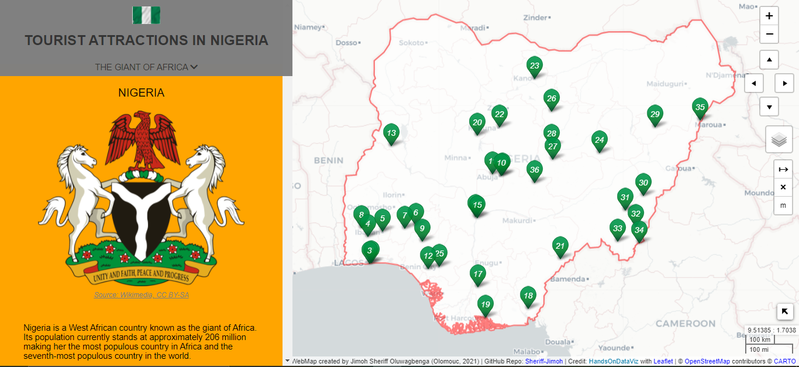

# [Tourist Attractions in Nigeria web application](https://sheriff-jimoh.github.io/tourist-centres-in-nigeria/)

This is the repository for the web cartography semester project: Tourist Attractions in Nigeria by Jimoh Sheriff Oluwagbenga in the [Department of Geoinformatics](http://www.geoinformatics.upol.cz/) at [Palacky University Olomouc](https://www.upol.cz/), Czech Republic. This map was built using [Hands-On Data Visualization Leaflet Story Maps with Google Sheets](https://HandsOnDataViz.org/leaflet-storymaps-with-google-sheets.html) by [Ilya Ilyankou](https://github.com/ilyankou) and [Jack Dougherty](https://github.com/jackdougherty) at Trinity College, CT and the code was adapted by [Jimoh Sheriff Oluwagbenga](https://github.com/Sheriff-Jimoh).

## License

  

For more information email me at sherobranding@gmail.com.
